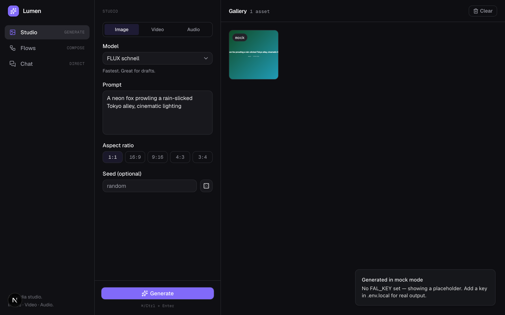
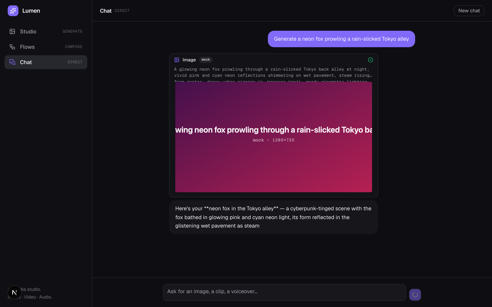
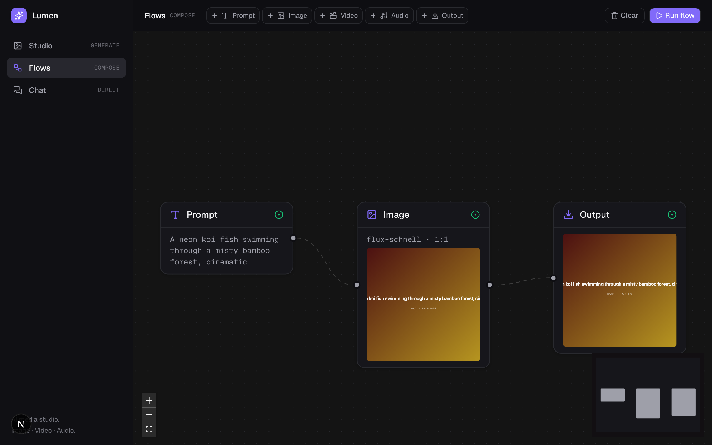

# Lumen — AI Media Studio

> Generate, compose, and direct media with AI.

Lumen is an AI media-generation app with three connected surfaces:

- **Studio** — generate image / video / audio via Fal.ai (Nano Banana, GPT Image, Seedream, Seedance, Kling, Veo, ElevenLabs).
- **Flows** — a node-based canvas to chain creative steps (prompt → image → video → audio).
- **Chat** — a tool-calling assistant (Claude / Gemini / GPT via the Vercel AI Gateway) that generates assets and builds flows.

**Bring your own key.** No shared keys: users add their Vercel AI Gateway key (Chat) and Fal.ai key (media)
in the in-app **Settings** tab. Keys live in the browser and are sent per-request — never stored server-side.

Dark-first UI, single accent, built to feel between Linear and Higgsfield.

## Demo

**Studio** — generate image / video / audio. Runs in mock mode without API keys.



**Chat** — describe what you want; the assistant calls tools and the result lands inline (and in your Studio gallery).



**Flows** — chain a prompt into image/video/audio nodes and run the graph end to end.



> Screenshots are running in **mock mode** (no API keys) — the gradient placeholders are the mock provider.
> With real keys the same UI shows real model output.

## Setup (2 steps)

```bash
pnpm install
pnpm dev          # http://localhost:3000
```

No env files. **Runs with zero keys** in mock mode (gradient placeholders). For real output, open the
**Settings** tab and paste your keys:
- **Vercel AI Gateway key** → Chat ([create one](https://vercel.com/dashboard/ai-gateway))
- **Fal.ai key** → image / video / audio ([get one](https://fal.ai/dashboard/keys))

## Models

| Surface | Models (via the picker) |
|---|---|
| Chat | Claude Sonnet 4.6 · Gemini 3.5 Flash · GPT-5.4 mini — all through the Vercel AI Gateway |
| Image | Nano Banana 2 · Nano Banana Pro · GPT Image 2 · Seedream 5 (Fal) |
| Video | Seedance 2.0 · Kling 3.0 Pro · Veo 3.1 (Fal) |
| Audio | ElevenLabs Turbo v2.5 (Fal) |

Each model uses its real Fal slug and input schema (verified against Fal's OpenAPI).

## Stack

Next.js 16 (App Router) · TypeScript strict · Tailwind v4 · shadcn/ui (base-ui) · Vercel AI SDK v6 +
AI Gateway · Fal.ai (all media) · React Flow · Zustand (persist).

## Architecture

- **BYOK**: keys are entered in Settings, kept in `localStorage`, and sent per-request as headers
  (`x-ai-gateway-key`, `x-fal-key`). The server reads them from the request, never from the environment.
- `src/lib/providers/` — `generate(req, { falKey })` routes all media through Fal (`models.ts` holds the
  catalog + per-model input builder) with timeout + retry, falling back to a `mock` when no key is set.
- `src/app/api/chat` — `createGateway({ apiKey })` with the selected `provider/model` slug + tool calling.
- `src/lib/store/` — one Zustand store per domain (`studio`, `flows`, `chat`, `settings`), all persisted.
- `src/components/{layout,studio,flows,chat,settings}` — feature UI on shadcn primitives + DESIGN.md tokens;
  `brand-logos.tsx` renders the model picker logos.

See `CLAUDE.md` (team conventions), `SPEC.md` (features + acceptance criteria),
`DESIGN.md` (design system), `PLAN.md` (roadmap), `DECISIONS.md` (architecture log).

## Deploy to Vercel

```bash
pnpm dlx vercel            # link & deploy a preview
pnpm dlx vercel --prod     # promote to production
```

**No environment variables required** — the app is bring-your-own-key, so each visitor supplies their
own keys in the Settings tab. The `/api/chat` and `/api/generate` routes run on the Node.js runtime
(`maxDuration` is raised for video).

## Status

| Surface | State |
|---|---|
| Studio — image / video / audio | ✅ Done & verified (build/types/lint green, tested end-to-end) |
| Chat — streaming + tool calling | ✅ Done & verified live (generates assets into Studio) |
| Flows — canvas + node graph + execution | ✅ Done & verified (topological run, prompt→image→output) |
| Cross-integration (all 4 directions) | ✅ Done & verified (Chat↔Studio, Chat→Flows, Studio↔Flows) |
| BYOK + AI Gateway + model picker | ✅ Done & verified (Settings tab, logos, Fal-only media) |
| Deploy to Vercel | ⏳ Ready to deploy — no env vars needed (run by the owner) |

Roadmap and what's in/out per day: `PLAN.md`.

---

Built as a portfolio demo. The team of agents that builds it lives in `.claude/agents/`.
